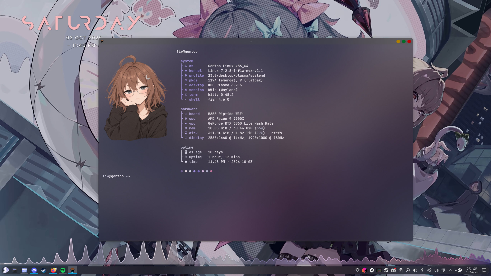
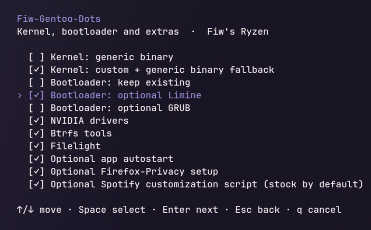

<div align="center">


# Fiw-Gentoo-Dots

**My Gentoo setup, ready to make home feel like home again.**


[Setup](docs/setup.md) · [Shortcuts](docs/shortcuts.md) · [Styling](docs/kde-style.md) · [Packages](#packages)

</div>

## About

My personal Gentoo restoration kit, mainly for my own devices:

- KDE colours, fonts, cursor, window styling and my exact keybinds.
- Separate package lists and individually optional app configs.
- Fish, Kitty and Neovim preferences that work across compositors.
- Binaries preferred, with a small deliberate source-build list.
- A Bubble Tea chooser with a final preview, conflict prompts and backups.

Package and boot actions still need a first run on a fresh Gentoo installation.

## Screenshots

### Desktop



My running desktop. Wallpapers and panels stay local; the saved Fastfetch
preset uses the built-in Gentoo logo.

### Installer



## Start

```sh
git clone https://git.fiwlabs.dev/fiwdev/Fiw-Gentoo-Dots.git
cd Fiw-Gentoo-Dots
./install
```

Start from an installed Gentoo system. Linux amd64 includes a prebuilt TUI;
Git and Python 3.11+ are enough. Go 1.24+ is needed only for source builds.
Choose your packages/configs, review the plan, then select an action.
Enter saves your choices without applying them.

See [setup and TUI keys](docs/setup.md), [tagged snapshots](docs/releases.md),
[saved devices](docs/devices.md), [config updates](docs/updates.md) and
[backup restoration](docs/backups.md).

## Presets

| Preset | Build settings | Kernel |
|---|---|---|
| Stock | Portable settings, binaries preferred | Generic Gentoo binary kernel |
| Fiw's Ryzen | Ryzen 9900X / Zen 5 tuning and NVIDIA | Custom kernel + binary fallback |

Both compile Fastfetch, jq and zip. Selected custom kernels and modules also
compile. Other source builds require a compile-or-skip choice; missing/skipped
packages appear in the [final report](docs/reports.md).

## Packages

| List | Contents |
|---|---|
| [kde](packages/kde.list) | Plasma, Plasma Login Manager and desktop components |
| [fiw-apps](packages/fiw-apps.list) | Everyday apps, including Dolphin, Ark, Gwenview and Spectacle |
| [cli](packages/cli.list) | Shell and terminal utilities |
| [dev](packages/dev.list) | Languages and development tools |
| [gaming](packages/gaming.list) | Steam, Proton, Prism, MangoHud and r2modman |
| [system](packages/system.list) | System utilities; kernels follow your selection |
| [fiw-tools](packages/fiw-tools.list) | FiwNode, Apdatifier Gentoo, OpenDeck and Music Presence |
| [tidewm](packages/tidewm.list) | Optional compositor and supporting tools |

Filelight, NVIDIA and Btrfs tools are separate extras. Sober and LocalSend are
individually optional Flatpaks. Limine and GRUB are optional; keeping the
existing bootloader is the default. See [boot setup](docs/boot.md).

## Configs

Every [app config](docs/app-configs.md) is independently optional. KDE styling
includes matching GTK preferences; autostart has its own checkbox.
Neovim's Catppuccin theme, VS Code's ayu MiDas theme, fonts and cursor assets
are bundled with their licences. Accounts and sessions stay local.

Local edits are preserved on updates, with proposed changes saved as `.new`
for review. Replaced files get backups. Spotify stays stock;
[customization](docs/spotify.md) and [Firefox-Privacy](docs/firefox.md) are
explicit optional steps.

## Maintenance

```sh
python3 tools/capture.py --config kde-shortcuts
python3 tools/capture.py --config kitty neovim
python3 tools/check-private.py
```

Review `git diff` before committing. See [capture options](docs/capture.md)
and [helper commands](docs/scripts.md). Device choices and local files are
gitignored. Forgejo is primary; [GitHub](https://github.com/Fi3w0/Fiw-Gentoo-Dots)
receives branches and tags automatically after [CI checks](docs/ci.md).

## License

Original code and configs: [MIT](LICENSE). Bundled third-party assets keep
their own licences; see [credits](docs/assets.md).

<div align="center">A personal Gentoo setup by Fiw.</div>
